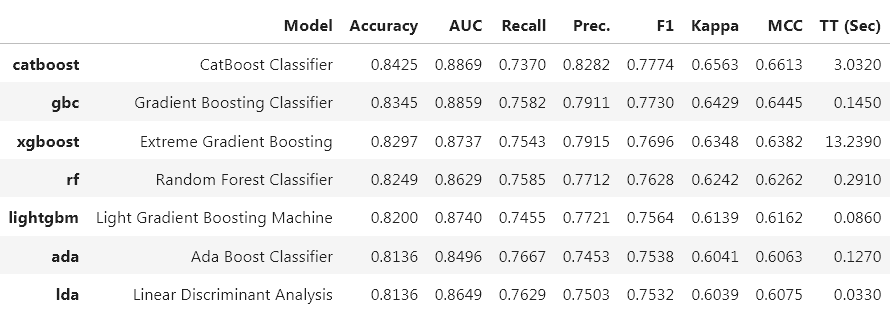

class: center

```{r include = F, message = F, warning=FALSE}
library(tidyverse)
library(xaringanthemer)
library(xaringanExtra)
library(plotly)
library(knitr)
```


```{r xaringan-logo, echo=FALSE}
style_mono_light("#0b2c57")
```
```{r echo = FALSE}
xaringanExtra::use_logo(image_url = "https://github.com/predict-icmc/presentations/raw/master/logo-predict.png")
```


## Sobre a apresentação

- **Motivação**: o pipeline padrão de um cientista de dados requer muitas linhas de código. 

- **Objetivo**: apresentar o módulo `pycaret` como maneira de resolver problemas do Predict em 2020 e 2021, indicar como utilizá-lo como ferramenta.

---
## Qual o foco de nossa análise?

  - **2020**: Modelos de regressão
    - **Resposta**: total acumulado de casos
      - **Modelo**: Gompertz
      
    - **Resposta**: novos casos /óbitos diários
      - **Modelo**: SARIMA, Redes Neurais

  - **2021**: Modelos de classificação
  
    - **Resposta**: indivíduo veio óbito ou não
      - **Modelo**: Regressão logística, ...
      
---

class: center, middle
    
```{r eval = F, echo=FALSE, message = FALSE}
library(data.table)
library(lubridate)
library(xts)
library(forecast)
library(tidyverse)
library(minpack.lm)
library(plotly)

selectedCity <- fread("https://github.com/predict-icmc/covid19/raw/master/leitura-dados/sp_ts_.csv")[1:370]
selectedCity$date <- as_date(selectedCity$date)
```
```{r  gompertz-model, eval = F, echo = FALSE, message = F}
dt <- selectedCity[1:120] %>% mutate(totalCases = cumsum(newCases),
                                     tempo = index(date)) %>% select(!c(newCases, date))

fit.Gompertz.cases <- nlsLM(totalCases ~ SSgompertz(tempo, Asym, b2, b3),
                        #start = c(Asym=1,b2=0,b3=0),
                        data = dt)

XX = (0:(max(dt$tempo)+10))
 Asym.G<-coef(fit.Gompertz.cases)[1]
 b2.G<-coef(fit.Gompertz.cases)[2]
 b3.G<-coef(fit.Gompertz.cases)[3]
 
 yp.G<-0
 
 yp.G<-Asym.G*exp((-b2.G)*(b3.G)^XX)
 
 inter <- confint(fit.Gompertz.cases)
 
 yp.G.min<-inter[1,1]*exp((-b2.G)*(b3.G)^XX)
 yp.G.max<-inter[1,2]*exp((-b2.G)*(b3.G)^XX)
 
 predict.G<-data.frame(x=XX,y=yp.G, min = yp.G.min, max = yp.G.max)
 
 predict.filtra <- predict.G %>% filter(x > max(dt$tempo))
 
 selectedCity.filtra <- dt %>% filter(tempo > max(dt$tempo)-90)
 # gera o grafico
 o<-  ggplot() + 
   geom_line(aes(x = tempo, y = totalCases), size = 1, color = "blue", data = selectedCity.filtra) +
   geom_point(aes(x=x, y = y, color = "Gompertz"),
              data = predict.filtra) +
   geom_errorbar(aes(x = x, ymin=min, ymax=max), colour="black", alpha = 0.6, data = predict.filtra) +
   labs(title = 'Previsão de casos confirmados de COVID-19', x = 'Dias', 
        y = 'Total de casos confirmados', fill = '', color = "Modelo") +
   theme_bw()
 save(o, file ="p1.rda")
```

```{r echo=FALSE, out.height="85%", out.width="100%"}
load("p1.rda")
ggplotly(o)

```

---

class: center, middle

```{r nnar, eval = F, warning = F, echo=FALSE}
ts <- xts(frollmean(selectedCity$newCases,7),selectedCity$date)

  fit <- nnetar(ts)

  pred <- predict(fit,14, PI = T, level =c(0.95, 0.80))

trace1 <- list(
   line = list(
     color = "rgba(0,0,0,1)", 
     fillcolor = "rgba(0,0,0,1)"
   ), 
   mode = "lines", 
   name = "observed", 
   type = "scatter", 
   x =  selectedCity$date,
   y =  round(frollmean(selectedCity$newCases, 7)), 
   xaxis = "x", 
   yaxis = "y"
 )
 trace2 <- list(
   fill = "toself", 
   line = list(
     color = "rgba(242,242,242,1)", 
     fillcolor = "rgba(242,242,242,1)"
   ), 
   mode = "lines", 
    name = "95% confidence", 
   type = "scatter", 
   x = c(min(selectedCity$date) - ddays(1) + ddays(time(pred$mean)), rev( min( selectedCity$date)  - ddays(1) + ddays( time( pred$mean)))),
   y = round( c( pred$upper[,1], rev(pred$lower[,1]))),
   xaxis = "x", 
   yaxis = "y", 
   hoveron = "points"
 )
trace3 <- list(
   fill = "toself", 
   line = list(
     color = "rgba(204,204,204,1)", 
     fillcolor = "rgba(204,204,204,1)"
   ), 
   mode = "lines", 
   name = "80% confidence", 
   type = "scatter", 
   x = c(min(selectedCity$date) - ddays(1) + ddays(time(pred$mean)), rev( min( selectedCity$date)  - ddays(1) + ddays( time( pred$mean)))),
   y = round( c( pred$upper[,2], rev(pred$lower[,2]))),
   xaxis = "x", 
   yaxis = "y", 
   hoveron = "points"
 )
 trace4 <- list(
   line = list(
     color = "rgba(0,0,255,1)", 
     fillcolor = "rgba(0,0,255,1)"
   ), 
   mode = "lines", 
   name = "prediction", 
   type = "scatter", 
   x = min(selectedCity$date) - ddays(1) + ddays(time(pred$mean)),
   y = round( pred$mean), 
   xaxis = "x", 
   yaxis = "y"
 )
 data <- list(trace1, trace2, trace3, trace4)
 layout <- list(
   title = "Forecast from NNAR", 
   xaxis = list(
     title = " ", 
     domain = range(selectedCity$date)
   ), 
   yaxis = list(
     title = "Novos Casos Confirmados (Média Móvel de 7 dias)", 
     domain = c(0, 1)
   ), 
   margin = list(
     b = 40, 
     l = 60, 
     r = 10, 
     t = 25
   )
 )
 p <- plot_ly()
 p <- add_trace(p, line=trace1$line, mode=trace1$mode, name=trace1$name, type=trace1$type, x=trace1$x, y=trace1$y, xaxis=trace1$xaxis, yaxis=trace1$yaxis)
 p <- add_trace(p, fill=trace2$fill, line=trace2$line, mode=trace2$mode, name=trace2$name, type=trace2$type, x=trace2$x, y=trace2$y, xaxis=trace2$xaxis, yaxis=trace2$yaxis, hoveron=trace2$hoveron)
 p <- add_trace(p, fill=trace3$fill, line=trace3$line, mode=trace3$mode, name=trace3$name, type=trace3$type, x=trace3$x, y=trace3$y, xaxis=trace3$xaxis, yaxis=trace3$yaxis, hoveron=trace3$hoveron)
 p <- add_trace(p, line=trace4$line, mode=trace4$mode, name=trace4$name, type=trace4$type, x=trace4$x, y=trace4$y, xaxis=trace4$xaxis, yaxis=trace4$yaxis)
 p <- layout(p, title=layout$title, xaxis=layout$xaxis, yaxis=layout$yaxis, margin=layout$margin, legend = list(orientation = "h"))
p <- p %>%  add_bars(y = selectedCity$newCases, x = selectedCity$date, name = "Novos casos diários")
save(p, file ="p2.rda")
```
```{r echo=FALSE, out.height="85%", out.width="100%"}
load("p2.rda")
p

```


---
class: center, middle

## Pycaret


```{r echo = F, out.width="70%", out.height="70%"}
include_graphics("https://miro.medium.com/max/625/1*2otHnNXOngAcvKzcTo_vlw.jpeg")
```

Fonte: https://brianray-7981.medium.com/google-clouds-automl-first-look-cb7d29e06377


---

## Pycaret

**O que é?**
   - Uma biblioteca para automatizar o pipeline padrão de um experimento em ciência de dados.


**Pró**:
 - Código mais compacto, robusto e interpretável;
 - É possível focar mais nos dados do que na programação.

**Contra**:
 - Necessário conhecer muito bem a documentação para entender o que está sendo feito, senão tudo vira uma caixa preta.
 - Por estar em desenvolvimento, novos módulos podem surgir e outros ficarem _deprecated_ rapidamente.

---

## Instalação local

- Altamente recomendável utilizar um ambiente virtual (a documentação explica como criar um)

```{bash eval = FALSE}
# install the full version of pycaret
pip install pycaret[full]
# time series module (beta)
pip install pycaret-ts-alpha
```

Fonte: https://pycaret.readthedocs.io/en/latest/installation.html

---

## Collab

Utilize a versão "slim"
```{python eval = FALSE}
!pip install pycaret
```

Também é necessário ativar o modo collab:

```{python eval = FALSE}
from pycaret.utils import enable_colab
enable_colab()
```


Fonte: https://pycaret.readthedocs.io/en/latest/installation.html

---

## Carregando Módulos
Atualmente, existem 6 módulos estáveis e um beta suportados.

```{python eval=FALSE}
from pycaret.classification import * # Classification
from pycaret.regression import *     # Regression
from pycaret.clustering import *     # Clustering
from pycaret.anomaly import *        # Anomaly Detection
from pycaret.nlp import *            # Natural Language Processing
from pycaret.arules import *         # Association Rule Mining
from pycaret.time_series import *    # Time Series (experimental)

```

--

 - **Classificação**: prever a classe de novas observações;
 
 - **Regressão**: prever valores de novas observações;
 
 - **Detecção de Anomalias**: identificar valores ou eventos raros.
 
 - **Processamento de Linguagem Natural**: análise de corpus textuais;
 
 - **Association Rule Mining**: $\{cebolas, batatas\} \rightarrow \{tomate\}$;
 
 - **Séries Temporais** (beta)
---

## Setup

Primeiro e único passo obrigarório em qualquer experimento. Embora o comando seja simples, muitas coisas acontecem aqui:

 - **Tipo dos dados**: inferido automaticamente, confira e pressione `enter`


Fonte: https://pycaret.org/setup/

---

## Setup

Também é possível passar os tipos diretamente através dos argumentos:

```{python eval = F}
categorical = ['asma', 'diabetes', 'obesidade']

numeric = ['idade']

clf = setup(data = dados, target='obito', 
            categorical_features = categorical,
            numeric_features = numeric,
            session_id = 4336)
```

 - **session_id**: semente aleatória, para reprodutibilidade do experimento
 
 - **limpeza/preparação**: tratamento de dados faltantes, data inputting
 
 - **amostragem**: modelos preliminares com diferentes tamanhos amostrais 
 
 - **data splitting**: a amostra é separada em treino e teste (70:30 por padrão)


Fonte: https://pycaret.org/setup/
---

## Comparando modelos

Passo inicial no _workflow_ de qualquer experimento supervisionado. Todos os modelos da biblioteca são ajustados e suas métricas de performance são avaliadas.

```{python eval = FALSE}
compare_models()
```


Fonte: https://pycaret.org/compare-models/

---

## Ajustar o modelo

Toma como parâmetro o ID do modelo e retorna uma tabela com métricas de validação cruzada em _k-folds_ (no caso supervisionado), assim como o modelo.

Por padrão, o parâmetro `fold = 10`.

```{python eval = F}
 dt = create_model('dt')
```


Métricas de avaliação que podem ser utilizadas:

 - **Classificação**: Accuracy, AUC, Recall, Precision, F1, Kappa, MCC.
 
 - **Regressão**: MAE, MSE, RMSE, R2, RMSLE, MAPE


Fonte: https://pycaret.org/create-model/

---

## Tunar o modelo

Encontra melhores hiperparâmetros do modelo criado através de um random grid search (modelos supervisionados). Similar à função `create_model()`

```{python eval = F}
tuned_dt = tune_model(dt)
```

 - Por padrão, essa função realiza 10 iterações aleatórias dentro do espaço de busca, controlado através do parâmetro `n_iter`
 
 - Aumentá-lo pode custar mais tempo, porém regularmente oferece um modelo melhor otimizado.
 
 - A métrica a ser otimizada pode ser definida através do parâmetro `optimize `. 
 
- Por padrão são utilizados o $R^2$ em tarefas de Regressão, e a _acurácia_ na Classificação.


Fonte: https://pycaret.org/tune-model/

---

## Modelo ajustado


Fonte: https://cdn.motor1.com/images/mgl/PqO9K/s1/saveiro-surf-2015-cabine-simples-ja-e-vendida-por-r-48050.jpg

---

## Modelo tunado

```{r echo = F, out.height="85%", out.width="80%"}
include_graphics("https://pbs.twimg.com/media/DwHbcrHXcAAZtp1.jpg")
```

Fonte: https://pbs.twimg.com/media/DwHbcrHXcAAZtp1.jpg

---

## E em seguida?

Depende da sua tarefa, do seu conhecimento e da sua disposição!

Alguns passos extras para a modelagem:

- Ensembling
  - Bagging
  - Boosting
- Blending
  - Model voting
- Stacking
  - Multiple Layer

Fonte: https://www.pycaret.org/ensemble-model


---

## O que mais?

 - Análise do modelo
  - Plots
  - Interpretação
  
 - Deployment
  - Previsões
  
  
## Vamos programar!

 1. `covid-class.ipynb`
 1. `covid-ts.ipynb`


---

## O que vimos hoje?

### mini-pipeline do pycaret:
   1. `setup()`
   1. `create_model()`
   1. `tune_model()`
   1. `finalize_model()`

---
class: center, middle, inverse

##"... all models are approximations. Essentially, all models are wrong, but some are useful. However, the approximate nature of the model must always be borne in mind...."

# George Box
